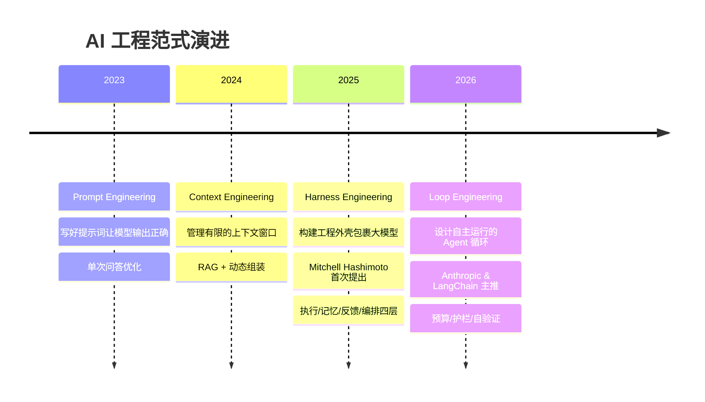
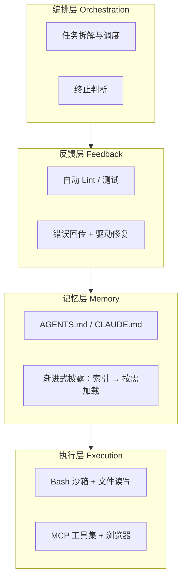
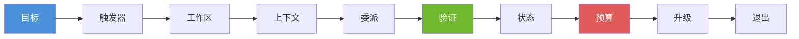
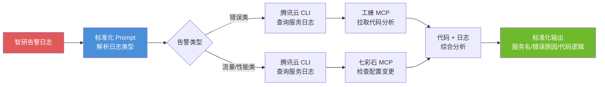
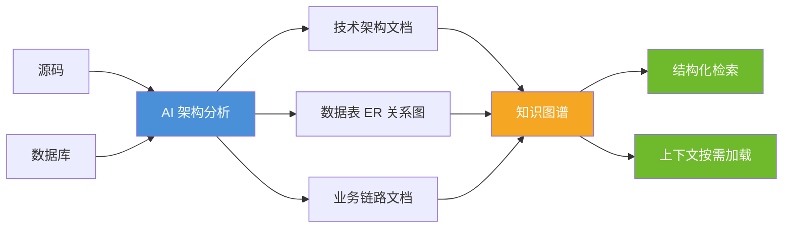
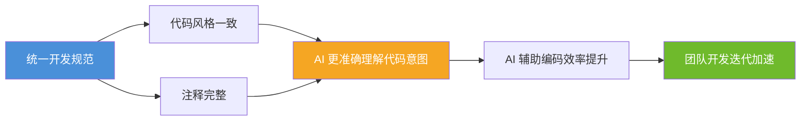
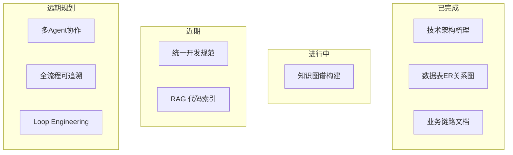
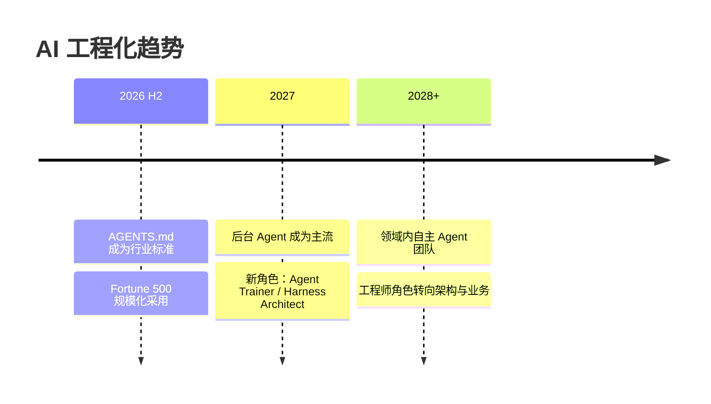

# AI 工程化探索：从 Prompt 到 Context 到 Harness 到 Loop

> 团队分享文档 · 2026 年 7 月

---

## 前言：AI 编程的真实痛点

| 痛点       | 表现                     |
| -------- | ---------------------- |
| **不可控**  | 幻觉、目标漂移、死循环不收敛         |
| **不可见**  | 决策黑盒、Token 消耗不可预测、质量波动 |
| **不可靠**  | 昨天能用今天不行、换模型行为大变       |
| **不可复用** | 每次都从头教 AI、团队经验无法沉淀     |
| **不可度量** | 没有 ROI 数据、改进方向不明确      |

**核心矛盾**：大模型是概率性的，生产环境是确定性的。模型越来越强，但靠"更好的 prompt"已无法解决系统性问题。

---

## 一、AI 工程范式演进

AI 工程化经历了清晰的三阶段演进（Prompt → Context → Harness），2026 年进一步延伸至 Loop Engineering：

**每层关系**：下层负责"说清楚"，上层负责"管得住"—— Prompt ⊂ Context ⊂ Harness ⊂ Loop，层层包裹。

---

## 二、核心技术框架

### 2.1 Prompt Engineering：从对话到指令工程

AI 编程的起点是**单次对话**——开发者输入问题，模型返回答案。这种方式的问题显而易见：每次都是全新开始，模型缺乏上下文，输出质量完全依赖提问者的表达能力。

Prompt Engineering 将"随便问"升级为**结构化的指令设计**，让模型输出从"随机发挥"向"可预期"收敛：

| 阶段                        | 技术手段           | 核心思路                                   |
| ------------------------- | -------------- | -------------------------------------- |
| **零样本（Zero-shot）**        | 直接提问，不给示例      | "把这段代码重构一下"                            |
| **少样本（Few-shot）**         | 提供 2-3 个输入输出范例 | 用示例定义期望的输出格式和风格                        |
| **思维链（Chain-of-Thought）** | 要求模型展示推理步骤     | "一步一步分析，先理解问题，再给出方案"                   |
| **角色设定（System Prompt）**   | 定义模型的角色和行为边界   | "你是一个资深 iOS 开发工程师，精通 SwiftUI 和 MVVM"   |
| **模板化（Prompt Template）**  | 将高频场景固化为可复用模板  | 标准化日志分析 Prompt、代码审查 Prompt、需求澄清 Prompt |

**Prompt Engineering 的核心贡献**：首次将"跟 AI 对话"从玄学变成可传授、可复用的技能。一套好的 Prompt 模板可以让不同的人获得相近质量的输出。

**但 Prompt Engineering 有明确的局限**：

- **稳定性差**：改动一个词，输出可能完全不同。同一 Prompt 在不同模型、甚至同一模型的不同版本上表现不一致
- **缺乏记忆**：每次对话独立，无法跨会话积累知识。AI 不知道项目用什么技术栈、遵循什么规范
- **幻觉不收敛**：Prompt 写得好可以降低幻觉概率，但无法根除——这是概率模型的本质特征
- **无法规模化**：每个新场景都需要手工调优 Prompt，人力成本线性增长

这些局限指向一个更根本的问题：**只靠优化"输入指令"无法解决系统性问题，需要从"输入"延伸到"环境"** —— Context Engineering 由此诞生。

### 2.2 Context Engineering：为 AI 构建操作系统

如果说 Prompt Engineering 是"教 AI 怎么说话"，Context Engineering 就是**设计 AI 思考和行动的完整环境**。

**核心类比（Andrej Karpathy）**：

> **"LLM 就像 CPU，上下文窗口就是 RAM。就像操作系统管理什么数据进入内存，Context Engineering 管理什么信息进入 AI 的上下文窗口。"**

这个类比揭示了为什么 Context Engineering 是 Prompt Engineering 的质变——Prompt 只是优化输入指令，Context 是在设计 AI 的"操作系统"。

**五项核心技术**（源自 Anthropic 2025 年工程实践总结）：

| 技术                                  | 说明                                          | 典型场景                                    |
| ----------------------------------- | ------------------------------------------- | --------------------------------------- |
| **渐进式披露（Progressive Disclosure）**   | 上下文只放索引（文件路径、表名、模块名），AI 按需通过工具加载完整内容        | 大型代码库导航：`CLAUDE.md` 放架构索引，具体文件由 AI 自行读取 |
| **压缩（Compaction）**                  | 将长对话历史压缩为结构化摘要，释放上下文窗口给当前任务                 | 长时间对话接近上下文上限时自动触发，保留关键决策和产物路径           |
| **即时加载（Just-in-Time Loading）**      | 工具定义、规范文件不预加载到上下文，而是 AI 在需要时主动获取            | 代码审查 Agent：先看 diff，发现安全相关变更时才加载安全规范     |
| **结构化笔记（Structured Note-Taking）**   | Agent 将进度、决策、待办写入外部文件，后续读取恢复状态              | 跨多轮对话的长时间任务：每完成一步写 checkpoint，崩溃后可恢复    |
| **子 Agent 隔离（Sub-Agent Isolation）** | 为子任务启动独立 Agent（干净上下文），只返回 1-2k token 的结构化摘要 | 并行调研多个技术方案，各自深入分析后汇总到主 Agent            |

**CLAUDE.md / AGENTS.md 是 Context Engineering 的工程化落地**：

- 放在项目根目录，每次会话自动加载
- 包含技术栈、编码规范、架构约定、常见陷阱
- 本质是"上下文预加载"——让 AI 在进入项目时无需反复询问基础信息
- 2026 年已逐步成为行业标准，GitHub、Vercel、LangChain 等公司均已采用

**Context Engineering 的核心洞察**（Anthropic）：

> **"找到最小的高信号 Token 集合，在有限的上下文窗口中最大化期望结果的概率。"**

换句话说：**不是塞越多越好，而是精准注入最有价值的上下文**。研究表明，结构精良的 16K token RAG 注入效果好于 128K 的全量上下文堆砌——因为后者稀释了注意力预算。

**但 Context Engineering 仍有局限**：

- **上下文窗口有限**：即使 200K token，对大项目仍不够——LLM 的注意力机制存在"迷失在中间"问题，中部信息理解准确率显著低于开头和结尾
- **信息检索精度瓶颈**：RAG 召回率和排序质量直接影响输出。关键信息没检索到，后续推理全错
- **被动性**：Context 决定了 AI 能看到什么，但**不控制 AI 会做什么**——AI 看到了正确的代码规范，依然可能写出不符合规范的代码
- **无验证闭环**：Context Engineering 解决的是"告知"问题，但缺少"验证"环节——AI 输出是否正确、是否合规，需要额外的工程机制来保障

这里正是 Context Engineering 的边界：**告知 AI 该做什么 ≠ 确保 AI 真的做到了**。要解决"确保做到"的问题，需要一个能约束、验证、纠正 AI 行为的工程外壳——即 Harness Engineering。

### 2.3 Harness Engineering：驾驭 AI 的工程外壳

> **"Agent = Model + Harness"** —— Mitchell Hashimoto（HashiCorp 创始人、Ghostty 作者）

Context Engineering 解决了"告知 AI"的问题，但**告知 ≠ 执行**。Harness Engineering 进一步解决"约束 AI 的行为"——如果 Context 是 AI 的操作系统，Harness 就是 AI 的**工程护栏**。Mitchell Hashimoto 在 2025-2026 年间系统阐述了 Harness 思想，核心理念是：

> **"每次发现 Agent 犯了一个错误，不要只是修正它——而是设计一个工程机制，让它永远不会再犯这类错误。"**

这意味着：当 AI 写出不规范的代码，不是让它重写，而是把规则写入 `CLAUDE.md`；当 AI 使用了错误的技术栈，不是手动修改，而是配置 Linter 自动拦截。**每条规则背后都是一次失败——Harness 的本质是用工程手段将失败教训固化为系统约束。**

LangChain 团队通过纯粹的 Harness 改进（不改模型），将编码 Agent 准确率从 **52.8% 提升到 66.5%**；Vercel 将 v0 的工具从 15 个精简到 2 个最有用的，准确率从 **80% 提升到 100%**。这些数据说明：**在模型能力确定的情况下，Harness 质量决定了 Agent 的上限。**

Harness 原意是马的缰绳——没有缰绳，再好的马也无法驾驭。Harness 通过四个核心动作让 AI 从"能回答"变成"能完成"：

| 动作                | 含义        | 工程实现                    |
| ----------------- | --------- | ----------------------- |
| **Constrain（约束）** | 设定边界，防止越界 | 权限控制、沙箱、禁止清单            |
| **Inform（告知）**    | 提供上下文     | CLAUDE.md、AGENTS.md、RAG |
| **Verify（验证）**    | 自动检查输出    | Linter、单元测试、E2E 测试      |
| **Correct（纠正）**   | 基于反馈迭代    | 错误回传 → 自动修复 → 再验证       |

**Harness 四层架构**：

> **"大模型越强，外壳可以做得越薄，但这层外壳永远不会消失。"**

### 2.4 Loop Engineering：让 AI 自主持续运行

Loop 解决的是 Harness 之外的问题——让 Agent 从"单次可控"走向"持续自主运行"。

**核心逻辑**：每个 Loop 本质上是一份"自主运行合同"，需明确以下要素：

**关键设计原则**：

- **确定性检查把关**：用测试/类型/lint 判定完成，不让 Agent 自评
- **硬预算上限**：迭代次数、Token、时间三者至少设其一
- **熔断机制**：连续无进展 → 自动终止通知人工
- **先 Harness 再 Loop**：单次不可靠的系统，循环只会放大问题

---

## 三、个人AI实践

### 3.1 .从对话到工程体系的认知演进

#### 3.1.1 智能日志分析 Prompt：MCP 驱动的故障定位

针对团队项目日志定位效率低的问题，构建了一套基于标准化 Prompt + MCP 工具链的智能分析流程：

**流程要点**：

- 告警日志按标准格式打印（服务名、方法、错误码、错误消息、同比/环比数据），Prompt 根据告警内容自动分流
- **错误类告警**：调用腾讯云 CLI 按时间范围和关键字检索对应服务日志 → 工蜂 MCP 拉取报错服务代码 → 结合代码与日志分析根因
- **流量/性能类告警**：额外查询七彩石 MCP 判断是否存在配置变更，综合同比/环比数据分析
- **输出标准化**：统一格式输出服务名称、错误原因、代码逻辑、修复建议

#### 3.1.2 日志采集分析平台：从 AI 失控到工程化重构

主导搭建了一套日志采集分析平台，具备自动采集、错误聚合、可视化统计、大模型智能分析日报等功能。整个开发过程完整经历了 AI 工程化认知的三个阶段：

| 阶段     | 认知水平                | 做法                                           | 结果                                                               |
| ------ | ------------------- | -------------------------------------------- | ---------------------------------------------------------------- |
| **初期** | 对话驱动                | 只定义功能需求，直接让 AI 自由开发                          | 技术选型混乱（Python + SQLite）、前后端高度耦合、UI 风格不统一；反复对话修改细节，沟通成本极高，效果远不达预期 |
| **中期** | Prompt + Context 工程 | 先定义标准化约束（卡帕奇编程思想、统一技术栈、编码规范），再明确整体架构后让 AI 执行 | 将项目从 Python 无缝迁移重构为 Java 技术栈，完成全量接口功能测试与页面模拟验证                   |
| **后期** | Skill 工程化           | 整理项目架构索引，后续迭代严格遵循统一规范                        | AI 稳定按架构要求完成迭代，不再需要反复对齐需求和细节，开发效率与交付质量大幅提升                       |

**核心认知**：从单纯的"跟 AI 对话" → 定义标准化 Prompt → 建立结构化 Context（技术栈、架构索引、编码规范）→ 沉淀为可复用的 Skill 工程体系。每一步都是对 AI 不可控性的逐步收敛。

### 3.2 Skills 实践：DDD 全栈开发工作流工程化

将 DDD 全栈开发的完整工作流固化为可复用的 Skill 文件，形成三个 Skill 覆盖完整链路：

| Skill                         | 类型         | 职责                                                            |
| ----------------------------- | ---------- | ------------------------------------------------------------- |
| `ddd-web-fullstack-dev`       | 单 Agent    | 一个 Agent 承载全部 8 步：战略 DDD → 战术 DDD → 架构文档 → 编码 → 单测 → E2E → 验收 |
| `ddd-web-fullstack-agent-dev` | 多 Agent 接力 | Planner（设计）→ Dev（编码）→ QA（测试）三阶段接力，每阶段只加载本阶段规范                 |
| `ddd-design-review`           | 单 Agent    | 对设计方案进行规范合规评审，输出内容解析 + 优缺点 + 改进意见                             |

核心原则：**先建模再编码，测试不全绿不报完成。**

**单 Agent vs 多 Agent 对比**：

| 维度        | 单 Agent                  | 多 Agent 接力                                           |
| --------- | ------------------------ | ---------------------------------------------------- |
| **上下文管理** | 全量 Skill 文件一次性加载，大项目容易超限 | 每阶段只加载当前需要的规范文件，上下文精简                                |
| **质量保障**  | 自查自纠，缺少独立验证视角            | 三道独立关卡：方案审批 → mvn test 全绿 → Playwright 全绿，问题在阶段边界被拦截 |
| **协作复杂度** | 低，无需产物交接                 | 需精确传递产物路径（ARCHITECTURE.md、DEV_PLAN.md）               |
| **分阶段审批** | 仅编码前一次用户审批               | Planner 产出后审批 + Dev 完成后 QA 独立验收                      |
| **适用场景**  | 小型项目、快速原型                | 中大型项目、需要独立 QA 验证的场景                                  |

**多 Agent 的必要性**：

- **上下文隔离**：DDD 全栈项目涉及架构文档、DDL、前后端代码、测试规范，单 Agent 一次性加载必然超出上下文窗口；多 Agent 拆分后每阶段上下文控制在安全水位
- **独立验证**：设计、编码、测试由不同 Agent 执行，避免"自己审自己"的盲区——QA Agent 独立跑 Playwright 是对 Dev Agent 编码质量的硬校验
- **质量门禁**：每阶段有明确通过条件，问题在阶段边界被拦截不传导到下游，避免"编码完成后才发现设计有问题"

### 3.3 个人项目实战：CoinFlow — Harness 工程化落地

#### 3.3.1 项目背景

CoinFlow 是个人 iOS 记账应用（SwiftUI + MVVM），基于前面积累的 AI 工程化经验，将 Harness 思想落地为项目专属的 AI 研发基础设施。

#### 3.3.2 先定标准、再定架构、再规范流程

CoinFlow 的启动方式与传统 AI 开发截然不同——**没有先急于敲定技术架构，而是以需求为核心，让 AI 直接基于真实业务场景，设计出一套可在 iOS 真机运行、Swift 实现的完整 UI 交互原型**。这套真机 UI 成为后续所有开发的走查标准，完全对齐真实项目的标准流程：

整个流程对标正规研发流程，再结合 Harness 思想固化为项目专属的 AI 研发基础架构。

**核心理念**：先定标准（UI 原型）→ 再定架构 → 再规范 AI 执行流程，让 AI 不再自由发挥，而是完全按照真实项目流程、固定规范交付。

#### 3.3.3 coinflow-workflow：Harness 四层落地的 Skill 设计

将上述流程固化为四个命令 + 三角色协作的 Skill 体系：

| Harness 动作        | Skill 实现                                                                            |
| ----------------- | ----------------------------------------------------------------------------------- |
| **Constrain（约束）** | `tech-boundaries.md` 定义硬约束（iOS 26+、禁止 SwiftData、金额用 Decimal、SQL 参数化、KISS/DRY/YAGNI） |
| **Inform（告知）**    | `coinflow-patterns` 提供架构模式（MVVM+Repository、主题系统、导航模式）、`PROJECT_PLAN.md` 追踪进度        |
| **Verify（验证）**    | 四命令三角色协作，QA 角色独立在 iOS 26.x 真机验证，/polish 含三主题全量截图对比                                  |
| **Correct（纠正）**   | QA 发现问题 → 提回 DEV → 修复 → 重新验证，循环至全绿                                                  |

**四命令体系**：

| 命令         | 角色链           | 产出                                                |
| ---------- | ------------- | ------------------------------------------------- |
| `/plan`    | 用户 + AI       | 需求方向讨论，更新 PROJECT_PLAN.md                         |
| `/feature` | BA → DEV → QA | requirements.md + tech-design.md + test-report.md |
| `/bugfix`  | DEV → QA      | root-cause.md + verification-report.md            |
| `/polish`  | UI → DEV → QA | design-spec.md + visual-diff.md + test-report.md  |

#### 3.3.4 技术演进总结

从 3.1 的「对话 → Prompt → Context → Skill」认知演进，到 3.2 的 Skill 方法论，再到 CoinFlow 将这一切落地为真实可运行的项目：

- AI 从不可控的对话工具 → 被 Harness 约束为按规范执行的工程伙伴
- 先定 UI 标准、再定技术架构、再固化 AI 执行流程——每一步都在收敛 AI 的不可控性
- 技术栈、架构、编码规范全部固化到 Skill 文件，AI 行为从"随机发挥"变为"按流程交付"，产出质量和可控性大幅提升

### 3.4 AI 在其他方向的应用

| 方向                     | 说明                                                                                                                                                   |
| ---------------------- | ---------------------------------------------------------------------------------------------------------------------------------------------------- |
| **AI 辅助模拟面试**          | 使用 AI 搭建面试 Skills（[interview-records](https://github.com/Dovelizi/ai-tools-collection/tree/main/interview-records)），基于真实面经记录持续进化，覆盖技术问答、系统设计、行为面试等场景 |
| **AI 整理技术内容发布博客**      | 使用 AI 整理优质文章和技术视频的核心要点，转化为结构化博客内容发布到 [dovelizi.github.io](https://dovelizi.github.io/)                                                               |
| **AI VibeCoding 趣味项目** | 使用 AI 快速探索各类有趣小项目，低成本验证想法、学习新技术                                                                                                                      |

### 3.5 实用性 Skills 推荐

**首推：andrej-karpathy 编码原则**

- KISS/DRY/YAGNI、不可变数据、小文件小函数、不写注释除非 WHY——目前最成熟的 AI 编码行为规范

**编程第一性原则**（[AI 第一性原理规则](https://github.com/Dovelizi/ai-tools-collection/blob/main/skills/coding/AI%20%E7%AC%AC%E4%B8%80%E6%80%A7%E5%8E%9F%E7%90%86%E8%A7%84%E5%88%99%E6%9C%AA%E5%91%BD%E5%90%8D.md)，基于 karpathy 原则扩展）

- 14 章完整治理体系：行为铁律、预编码反思、自适应思考深度、外科手术式修改、简洁优先、工程基线、假设与验证、文档同步等
- 核心思想：**第一性原理思维**——每个决策追溯至系统约束或原子业务需求，而非遵循先例

**Superpowers（Skills 集合）**

- 一套完整的 AI 工程化 Skills 集合，涵盖从需求到交付的全流程。其中 **brainstorming** 是最核心的流程起点——在每次开发前通过结构化对话澄清需求、探索方案、输出设计文档，确保 AI 在充分理解需求后再进入实现阶段，从源头上收敛不可控性

**ECC 高频实用 Skills**（[ECC](https://github.com/affaan-m/ECC)）

| Skill                           | 用途           | 适用场景         |
| ------------------------------- | ------------ | ------------ |
| `ecc:frontend-design-direction` | UI/UX 设计方向指导 | 前端页面设计、组件美化  |
| `ecc:code-reviewer`             | 代码审查         | 每次写完代码后      |
| `ecc:security-reviewer`         | 安全漏洞检测       | 涉及认证、鉴权、用户输入 |
| `ecc:tdd-guide`                 | 测试驱动开发       | 新功能开发、Bug 修复 |
| `ecc:build-error-resolver`      | 构建错误修复       | 编译/构建失败时     |
| `ecc:planner`                   | 实现规划         | 复杂功能、重构前     |
| `ecc:architect`                 | 系统架构设计       | 技术选型、架构决策    |

---

## 四、团队落地实践：DAP 应用 AI 工程化路线

> 以团队核心项目 Dap 应用为落地载体，分阶段推进 AI 工程化，每一步都有明确的产出和验收标准。

### 4.1 让 AI 看懂项目：架构梳理与知识图谱

**已完成：全项目技术架构梳理**

前期借助 AI 完成了 DAP 应用的全项目技术架构梳理，产出包括：

- **技术架构全景图**：梳理项目整体分层结构（路由层 → Controller → Service → Model → 数据层），明确各层职责与依赖关系
- **数据表全景文档**：整理系统内所有数据表的使用场景、ER 关系图以及表之间的关联逻辑，覆盖核心业务表、配置表、日志表等
- **完整业务链路文档**：以典型业务场景为主线（如用户点击订单 → 推广者订单 → 请求进入项目 → 数据落库），记录涉及哪些库表、各环节数据流转与依赖关系等全流程细节

**进行中：知识图谱构建**

现阶段核心目标是将上述梳理成果结构化为项目知识图谱：

- 将架构文档、数据表关系、业务链路三类信息统一建模为结构化知识节点
- 建立节点之间的关联（如表与业务链路的关联、架构层与代码模块的映射）
- 实现项目信息可检索，后续开发时可快速查阅任意模块的架构定位、涉及数据表、上下游依赖

### 4.2 让 AI 规范编码：统一开发规范

**目标**：结合项目现有技术栈，统一制定开发规范，配合知识图谱让 AI 能准确理解项目架构与业务逻辑，提升 AI 辅助编码的效率与准确性。

**规范内容**：

| 规范类别        | 具体内容                                                           |
| ----------- | -------------------------------------------------------------- |
| **技术版本固定**  | 明确技术栈版本（Ruby 2.3.3、Rails x.x、MySQL x.x 等），消除版本不确定性对 AI 生成代码的影响 |
| **数据表设计规范** | 统一命名规范（表名、字段名、索引名）、字段类型选型标准、必备字段（created_at/updated_at）、索引设计原则 |
| **代码编写规范**  | 文件组织规则、命名规范、模块划分原则、错误处理模式                                      |
| **注释规范**    | 要求代码必须附带完整注释——类注释说明职责、方法注释说明入参/出参/副作用、关键逻辑注释说明 WHY             |

**设计考量**：团队对 Ruby 语法熟悉度不足，强制注释规范有两个目的：① 降低团队成员阅读代码的门槛；② 为 AI 提供更丰富的上下文，提升后续 AI 辅助编码的准确率。

**预期效果**：

### 4.3 让 AI 高效检索：RAG 代码索引

基于知识图谱与规范体系，构建 RAG（检索增强生成）代码层面的索引：

- 将源码、架构文档、业务链路文档向量化存储
- 支持自然语言检索——如"订单状态流转涉及哪些表"、"推广者分佣计算逻辑在哪"
- 开发新功能时，AI 自动检索相关代码上下文，减少手动翻阅成本
- 技术选型考量：向量数据库（Milvus/Chroma）+ Embedding 模型 + 检索策略（关键词+语义混合检索）

### 4.4 让 AI 自主协作：多 Agent 分工

在知识图谱 + RAG 基础设施就绪后，引入多 Agent 协作模式：

- 按职责划分 Agent 角色（如：需求分析 Agent、架构设计 Agent、编码 Agent、测试 Agent、代码审查 Agent）
- 明确每个 Agent 的工作范围边界：输入是什么、输出是什么、不做什么
- 定义 Agent 间的协作协议：产物格式、交接标准、冲突处理机制
- 目标：团队成员只需描述需求，多个 Agent 自动分工协作完成端到端交付

### 4.5 让 AI 可追溯：全流程报告

建立全流程可追溯的输出体系，每个节点都有完整文档记录：

| 节点   | 产出文档                    |
| ---- | ----------------------- |
| 需求分析 | BA 文档（业务需求说明、用例描述、验收条件） |
| 技术设计 | 技术文档（架构设计、接口定义、数据库变更）   |
| 开发实现 | 代码 + 单测报告               |
| 质量验证 | QA 文档（测试用例、测试结果、覆盖率报告）  |
| 验收上线 | 验收报告（验收清单、已知问题、回滚方案）    |

所有文档通过 AI 自动生成初稿，人工审核确认，确保每个节点的决策和产出可回溯。

### 4.6 让 AI 自动运行：探索 Loop Engineering

在前五步基础设施成熟后，探索 Loop Engineering 的团队实践：

- 选取适合自动化的场景（如：每日代码质量巡检、依赖升级检查、文档自动更新）
- 设计 Loop 运行合同：目标、触发器、工作区、上下文、验证标准、预算上限、退出条件
- 从低频低风险场景起步，验证稳定后逐步扩展自动化范围
- 目标：实现部分重复性工作的自主运行，释放团队精力到更有价值的决策和创造上

### 路线总览

> **核心思路**：先让 AI 看懂项目（知识图谱），再让 AI 规范编码（统一规范），然后逐步赋予 AI 检索、协作、追溯、自动运行的能力。每一步都建立在前一步的基础上，不跳步、不冒进。

---

## 总结

- **模型决定上限，工程决定落地**：Harness 不是新框架，而是一种工程思维方式
- **约束是为了加速**：越想让 AI 自主，越需要清晰边界——就像高速公路有护栏才能开到 120 码
- **数据驱动迭代**：有了可观测性才知道改进方向

